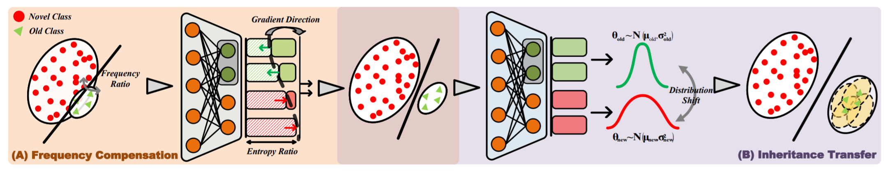
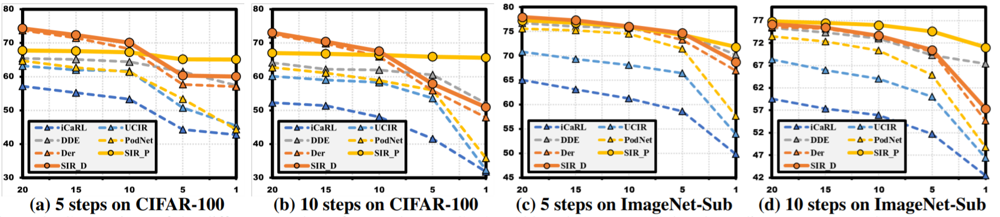

# Self-Paced Imbalance Rectification for Class Incremental Learning

PyTorch implementation of our Self-Paced Imbalance Rectification for Class Incremental Learning. This repository contains PyTorch evaluation code, training code and pretrained models.

## 📋 Table of content
 1. [📎 Paper Link](#1)
 2. [💡 Abstract](#2)
 3. [📖 Motivation](#3)
 
 4. [📃 Requirements](#5)
 5. [✏️ Usage](#6)
    1. [Train](#61)
 6. [📊 Experimental Results](#7)
 7. [✉️ Statement](#9)
 8. [🔍 Citation](#10)

## 📎 Paper Link <a name="1"></a> 
* Self-Paced Imbalance Rectification for Class Incremental Learning ([link](https://arxiv.org/abs/2106.14747))
> Authors:
> Zhiheng Liu*, Kai Zhu*, Yang Cao

## 💡 Abstract <a name="2"></a> 
Exemplar-based class-incremental learning is to recognize new classes while not forgetting old ones, whose samples can only be saved in limited memory. The ratio fluctuation of new samples to old exemplars, which is caused by the variation of memory capacity at different environments, will bring challenges to stabilize the incremental optimization process. To address this problem, we propose a novel self-paced imbalance rectification scheme, which dynamically maintains the incremental balance during the representation learning phase. Specifically, our proposed scheme consists of a frequency compensation strategy that adjusts the logits margin between old and new classes with the corresponding number ratio to strengthen the expression ability of the old classes, and an inheritance transfer strategy to reduce the representation confusion by estimating the similarity of different classes in the old embedding space. Furthermore, a chronological attenuation mechanism is proposed to mitigate the repetitive optimization of the older classes at multiple step-wise increments. Extensive experiments on three benchmarks demonstrate stable incremental performance, significantly outperforming the state-of-the-art methods.


## 📖 Motivation <a name="3"></a> 
### Self-Paced Imbalance Rectification for Class Incremental Learning <a name="31"></a> 
<p align="center">
     <br />
    <em> 
    </em>
</p>

**Motivation of our method**  (A) When the number ratio of new classes versus old ones varies in different environments, the representation is seriously biased to the optimization of new classes that appears at high frequencies. We propose a frequency compensation strategy to adjust the corresponding logits margin, thus enhancing the expression ability of the old class. (B) The incremental model initialed by the old parameters retains the representation bias, which tends to exacerbate confusion in certain classes. We propose to leverage the distance relationship among different classes to learn more discriminating features in our inheritance transfer strategy.


## 📃 Requirements <a name="5"></a> 
  - python 3.7 
  - pytorch 1.7.0
  - opencv

## ✏️ Usage <a name="6"></a> 

```bash  
git clone https://github.com/Johanan528/SIR.git
cd SIR
```
### Train <a name="61"></a> 
To run the Experiments, run `run_exp.py`:
```bash  
python run_exp.py   
```

## 📊 Experimental Results <a name="7"></a> 

<p align="center">
     <br />
    <em> 
    </em>
</p>


## ✉️ Statement <a name="8"></a> 
This project is for research purpose only, please contact us for the licence of commercial use. For any other questions please contact [lzh990528@mail.ustc.edu.cn](lzh990528@mail.ustc.edu.cn) or [zkzy@mail.ustc.edu.cn](zkzy@mail.ustc.edu.cn).

## 🔍 Citation <a name="9"></a> 


```
@article{luo2021one,
  title={One-Shot Object Affordance Detection in the Wild},
  author={Zhai, Wei and Luo, Hongchen and Zhang, Jing and Cao, Yang and Tao, Dacheng},
  journal={arXiv preprint arXiv:2108.03658},
  year={2021}
}
```
